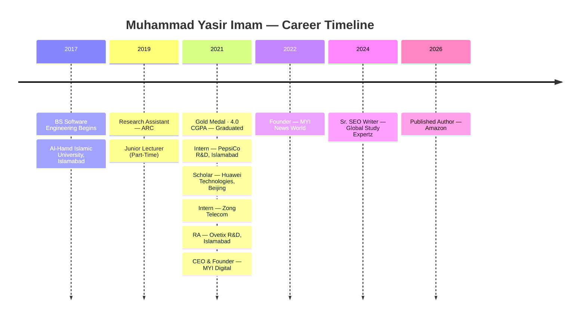

<!-- ═══════════════════════════════════════════════════════════════════════
     MUHAMMAD YASIR IMAM — GitHub Profile README
     Repository: muhammadyasirimam/muhammadyasirimam
     File: README.md
═══════════════════════════════════════════════════════════════════════ -->

<div align="center">

<!-- ─────────────── ANIMATED BANNER HEADER ─────────────── -->
<a href="https://muhammadyasirimam.github.io" target="_blank">
  
</a>

<!-- ─────────────── ANIMATED TYPING ─────────────── -->
<a href="https://muhammadyasirimam.github.io">
  
</a>

<br/>

<!-- ─────────────── PROFILE VIEWS + FOLLOWERS ─────────────── -->

&nbsp;
<a href="https://github.com/muhammadyasirimam?tab=followers">
  
</a>

</div>

---

## 🧭 Quick Navigation

<div align="center">

| 🔬 [Research](#-research--publications) | 🎓 [Academia](#-academic-profiles) | 📚 [Book](#-published-book) | 💼 [Experience](#-experience) | ✍️ [Writing](#-medium--writing) | 📬 [Contact](#-contact) |
|:---:|:---:|:---:|:---:|:---:|:---:|

</div>

---

## 👤 About Me


```yaml
Name:         Muhammad Yasir Imam
Pronouns:     he/him
From:         Rajanpur → Islamabad, Pakistan 🇵🇰
Role:         Research Assistant @ ARC, Al-Hamd Islamic University
              CEO & Founder @ MYI Digital
              Founder & CEO @ MYI News World
Education:    BS Software Engineering — 4.0 CGPA 🏅 Gold Medal
Citations:    19 (Google Scholar) | 1,710 Reads (ResearchGate)
Publications: 12 (ResearchGate) | 20+ (All Platforms)
Reviews:      Reviewer — USJICT & IJCNS Journals
Book:         "The Colors of Life Only We Can See" — Amazon 2026
Medium:       Award-Winning Researcher | 118 Followers
Status:       ✅ Open to Research Collaboration & Consultancy
```

<br clear="right"/>

### 🌟 My Journey in One Line
> *From 49% (D Grade) in matric → **4.0 CGPA Gold Medal** — documented on Medium with 17 responses from inspired readers worldwide.*

---

## 📊 Research Stats

<div align="center">

| 🎓 Google Scholar | 🔬 ResearchGate | 📄 Publications | 📖 Total Reads | 🏅 CGPA |
|:---:|:---:|:---:|:---:|:---:|
| **19 Citations** | **16 Citations** | **12 (RG) / 20+ all** | **1,710** | **4.0 / 4.0** |

</div>

---

## 🔑 Researcher Identifiers

<div align="center">

[](https://orcid.org/0000-0002-7495-4179)
[](https://www.webofscience.com/wos/author/record/G-4103-2019)
[](https://scholar.google.com/citations?user=b80oc1UAAAAJ)

[](https://www.researchgate.net/profile/Muhammad-Yasir-Imam)
[](https://ieeexplore.ieee.org/author/37088906312)
[](https://dblp.org/pid/320/8025.html)

</div>

---

## 🔬 Research & Publications

### 🎯 Research Areas

<div align="center">


</div>

### 📄 Verified Publications

| # | Title | Co-Authors | Venue | Year |
|---|-------|-----------|-------|------|
| 1 | [**A Product Recommendation System for e-Shopping**](https://www.researchgate.net/publication/360537047) | Z. Usmani, A. Khan, O. Usmani | ResearchGate · Conference | 2021 |
| 2 | **Near Helipad Auto Guidance System for Helicopter** | A. B. M. Khan | ResearchGate · Conference | 2021 |
| 3 | [**ATM Transaction Approach on the Basis of New Era**](https://www.researchgate.net/publication/344684180) | N. Jannat, M. B. Suleman, A. Rehman | ResearchGate · Article | 2020 |
| 4 | **Multi-Banking ATM via GSM & Biometric** | N. Jannat | Academia.edu · Article | 2020 |
| 5 | [**Part of Teachers and Parents in Children's Education**](https://www.researchgate.net/publication/344035153) | N. Jannat, G. S. Khan, A. Saleem | ResearchGate · Article | 2020 |
| 6 | **Enhanced e-Assessment Method Using IRT** | — | Academia.edu · Article | 2020 |
| 7 | **Air Pollution Tracking Model Using WSS** | — | ResearchGate · Article | 2020 |
| 8+ | **Additional 13+ Papers (Smart Grids, Blockchain, Pattern Recognition, DSS)** | Various | IEEE · Google Scholar | 2019–2024 |

<div align="center">

[](https://scholar.google.com/citations?user=b80oc1UAAAAJ)
[](https://www.researchgate.net/profile/Muhammad-Yasir-Imam)

</div>

---

## 🎓 Academic Profiles

<div align="center">

| Platform | ID / Handle | Status |
|----------|-------------|--------|
| 🎓 [Google Scholar](https://scholar.google.com/citations?user=b80oc1UAAAAJ) | `b80oc1UAAAAJ` | 19 citations |
| 🔬 [ResearchGate](https://www.researchgate.net/profile/Muhammad-Yasir-Imam) | Muhammad-Yasir-Imam | 12 papers · 1,710 reads |
| 🪪 [ORCID](https://orcid.org/0000-0002-7495-4179) | `0000-0002-7495-4179` | Verified ✅ |
| 🌐 [Web of Science](https://www.webofscience.com/wos/author/record/G-4103-2019) | `G-4103-2019` | Verified ✅ |
| ⚙️ [IEEE Xplore](https://ieeexplore.ieee.org/author/37088906312) | `37088906312` | Indexed ✅ |
| 💾 [DBLP](https://dblp.org/pid/320/8025.html) | `pid/320/8025` | Indexed ✅ |
| 📜 [Academia.edu](https://independent.academia.edu/MuhammadYasirImam) | MuhammadYasirImam | Active ✅ |
| 🔭 [SciProfiles (MDPI)](https://sciprofiles.com/profile/933416) | `933416` | Active ✅ |
| 📈 [AD Scientific Index](https://adscientificindex.com/scientist/muhammad-yasir-imam/4652608) | `4652608` | Top CS · Pakistan ✅ |
| 🔍 [Researchr](https://researchr.org/alias/muhammad-yasir-imam) | muhammad-yasir-imam | Indexed ✅ |
| 🌍 [Google Sites](https://sites.google.com/view/muhammad-yasir-imam/) | Personal Academic Page | Active ✅ |
| ✍️ [SF Shaw](https://sfshaw.com/author/myasirimam/) | myasirimam | Featured Contributor ✅ |

</div>

---

## 💼 Experience



### 🏢 Current Positions

<table>
<tr>
<td width="50%">

**🔬 Research Assistant — ARC**
Alhamd Research Center
Al-Hamd Islamic University · Islamabad
*Dept. Computer Science*
`XAI` `ML` `Smart Grids` `Radar` `Blockchain`

</td>
<td width="50%">

**🚀 CEO & Founder — MYI Digital**
Pakistan's Leading IT Outsourcing Company
Website · Software · Apps · SEO · Marketing
📧 info@myinews.world

</td>
</tr>
<tr>
<td width="50%">

**📰 Founder & CEO — MYI News World**
[myinewsworld.com](https://myinewsworld.com) · Android & iOS
Education · Tech · AI/ML · Business · World
*Designed & Developed by MYI Digital*

</td>
<td width="50%">

**✍️ Sr. SEO Content Writer & CS Instructor**
Global Study Expertz
500+ LinkedIn Connections
Award-Winning Researcher & Author

</td>
</tr>
</table>

### 🕐 Past Experience

| Role | Organisation | Period |
|------|-------------|--------|
| 🔬 Research Assistant | Ovetix · R&D · Islamabad | Jul 2021 – Jan 2022 |
| 🏢 Scholar | Huawei Technologies · R&D · Beijing | Aug 2021 |
| 🧪 Project Intern | PepsiCo Inc. · R&D · Islamabad | Jun – Aug 2021 |
| 📡 Project Intern | Zong · 4G Telecom · Pakistan | 2021 |
| 🏫 Junior Lecturer (Part-Time) | Al-Hamd Islamic University | 2019 – 2021 |

---

## 📚 Published Book

<div align="center">

<a href="https://a.co/d/04WhjuxY" target="_blank">
  
</a>

### [The Colors of Life Only We Can See](https://a.co/d/04WhjuxY)
#### *A Story about Life, Change, and Inner Strength*

**Genre:** Narrative Non-Fiction &nbsp;|&nbsp; **Year:** 2026 &nbsp;|&nbsp; **Platform:** Amazon

> *"Life is not lived in black and white. It moves in colors we feel, memories we carry, and moments that quietly change us. An emotional journey through love, loss, hope, and personal growth."*

[](https://a.co/d/04WhjuxY)
[](https://medium.com/@muhammadyasirimam)

</div>

---

## ✍️ Medium & Writing

> **"Published book author and Award-Winning Researcher. I write practical and impactful stories."**
> — Medium bio · 118 followers · he/him

### 📝 Latest Articles (Verified)

| Article | Publication | Responses | Date |
|---------|------------|-----------|------|
| 📌 [**From Poor Village to Gold Medalist: My Real Journey**](https://medium.com/@muhammadyasirimam/from-poor-village-to-gold-medalist-my-real-journey-47ad26d81b15) | Medium | **17** 🔥 | Jan 2026 |
| 📌 [**Why Mental Wealth Matters More Than Money?**](https://medium.com/@muhammadyasirimam/why-mental-wealth-matters-more-than-money-0408b001d2da) | Medium | **11** | Feb 2026 |
| 📌 [**How I Turn Stress into Clear Plans Using AI?**](https://medium.com/activated-thinker/how-i-turn-stress-into-clear-plans-using-ai-a110c330385c) | Activated Thinker | **7** | Feb 2026 |
| 📌 [**How to Write Consistently Without Burning Out in 2026?**](https://medium.com/@muhammadyasirimam/how-to-write-consistently-without-burning-out-in-2026-2f200cbb2122) | Medium | **4** | Feb 2026 |
| [**How I Write 3 High-Quality Stories a Week Without Burning Out**](https://medium.com/illumination/how-i-write-3-high-quality-stories-a-week-without-burning-out-in-2026-dfab08738690) | ILLUMINATION | 1 | Apr 2026 |
| [**A Boy Who Outsmarted the Algorithm**](https://medium.com/new-literary-society/a-boy-who-outsmarted-the-algorithm-937c2e30f019) | New Literary Society | 1 | Mar 2026 |
| [**5 AI Tools Every Content Strategist Needs to 10x Output**](https://medium.com/the-pub/5-ai-tools-every-content-strategist-needs-to-10x-output-without-losing-authenticity-2cdb647cc63d) | The Pub | 1 | Mar 2026 |
| [**7 Lessons My Childhood Taught Me**](https://medium.com/write-a-catalyst/7-lessons-my-childhood-taught-me-3552ab90c525) | Write A Catalyst | 1 | Mar 2026 |
| [**How I Learned to Protect My Inner Peace**](https://medium.com/illumination/how-i-learned-to-protect-my-inner-peace-without-cutting-everyone-off-0babecdeac08) | ILLUMINATION | — | Mar 2026 |
| [**3 Quiet Drains Silently Ruining Your Inner Strength**](https://medium.com/pen-with-paper/3-quiet-drains-silently-ruining-your-inner-strength-in-2026-d7d2a9558ca0) | Pen With Paper | 3 | Mar 2026 |

<div align="center">

[](https://medium.com/@muhammadyasirimam)

</div>

---

## 🛠️ Skills & Technologies

<div align="center">


</div>

---

## 🏆 Achievements & Awards

<div align="center">

| 🏅 | Achievement | Details |
|:---:|------------|---------|
| 🥇 | **Gold Medal · 4.0 CGPA** | BS Software Engineering · Al-Hamd Islamic University · 2021 |
| 🎓 | **19 Google Scholar Citations** | Verified at scholar.google.com · b80oc1UAAAAJ |
| 🔬 | **12 Publications · 1,710 Reads** | ResearchGate · 20+ across all platforms |
| 📈 | **AD Scientific Index** | Top Computer Scientists · Pakistan · ID: 4652608 |
| 📚 | **Published Author · Amazon** | "The Colors of Life Only We Can See" · 2026 |
| ✍️ | **Award-Winning Researcher** | Medium bio · 118 followers · Award-Winning Writer |
| 🏢 | **Huawei Scholar** | Selected for Huawei Technologies R&D · Beijing · 2021 |
| 🌐 | **Peer Reviewer** | USJICT & IJCNS · Computer Science Journals |

</div>

---

## 📈 GitHub Stats

<div align="center">


</div>

<div align="center">


</div>

---

## 🌐 MYI News World

> **"MYI stands for Muhammad Yasir Imam. He is the founder & CEO and driving force behind MYI News World."**

<div align="center">

[](https://myinewsworld.com)
[](https://myinewsworld.com/myi-news-android-app/)
[](https://myinewsworld.com/myi-news-ios-app/)

**Covers:** `Education` `Technology` `AI/ML` `Business` `World News` `Ecosystem` `Life` `Politics` `Auto` `Opinion`

[](https://www.facebook.com/myinewsworld)
[](https://www.instagram.com/myinewsworld/)
[](https://twitter.com/myinewsworld)
[](https://www.youtube.com/@MYINewsWorld)
[](https://www.tiktok.com/@myinewsworld/)
[](https://www.pinterest.com/myinewsworld/)

</div>

---

## 📬 Contact & Social

<div align="center">

[](mailto:imammuhammadyasir@gmail.com)
[](https://pk.linkedin.com/in/muhammad-yasir-imam)
[](https://x.com/m_yasir_imam)
[](https://www.youtube.com/c/MuhammadYasirImam)
[](https://www.facebook.com/muhammad.yasir.imam/)
[](https://medium.com/@muhammadyasirimam)
[](https://a.co/d/04WhjuxY)
[](https://muhammadyasirimam.github.io)

</div>

---

## 💡 Quote

<div align="center">

> *"From a poor village near the Indus River, writing code at age 11 on a Pentium PC —*
> *from 49% in matric to a Gold Medal with 4.0 CGPA.*
> *The trajectory can always change."*
>
> **— Muhammad Yasir Imam**

</div>

---

<!-- ─────────────── FOOTER WAVE ─────────────── -->
<div align="center">


**📍 Islamabad, Pakistan 🇵🇰** &nbsp;|&nbsp; **✉️ imammuhammadyasir@gmail.com** &nbsp;|&nbsp; **🔗 ORCID: 0000-0002-7495-4179**

*© 2026 Muhammad Yasir Imam — Research Scientist · CEO MYI Digital · Published Author · Gold Medalist*

</div>
